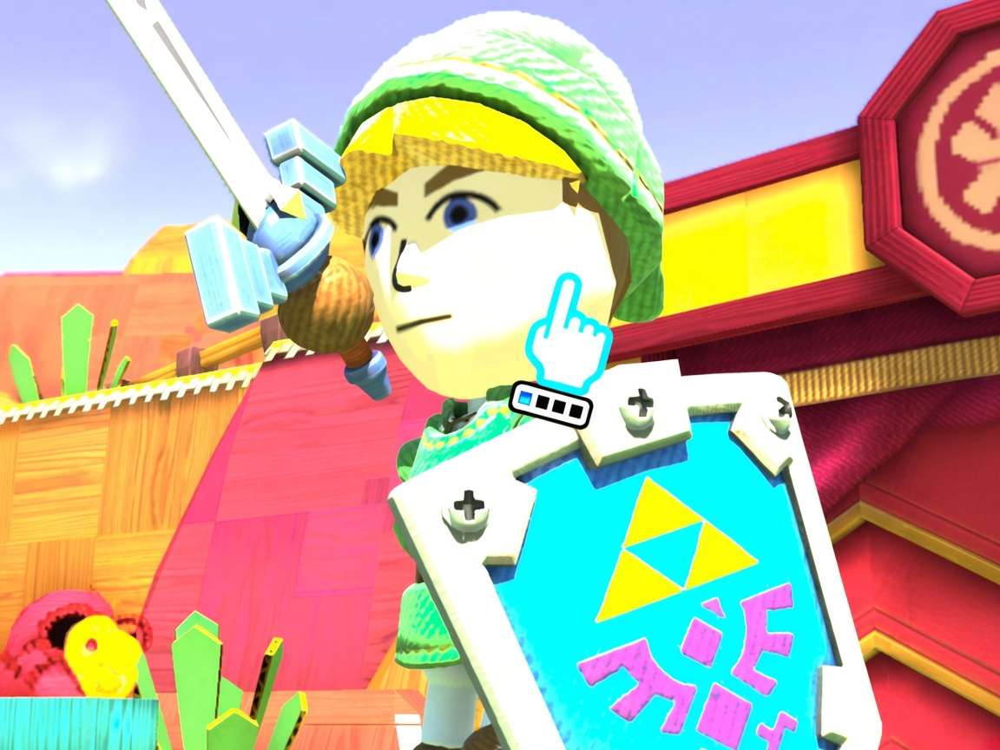

# Decent Cemu - The Cemu that sorts it out

This is a fork of [Cemu 2.6](https://github.com/cemu-project/Cemu).
This is a vibe-coded version of Cemu, build so you can have features the official release just doesn't give you. AI contributions are welcome.

## What it has

- Native Wii Remote, MotionPlus and Nunchuk support, with automatic setup
- An Android app that acts as the GamePad, including gyroscope (beta — help is welcome), touchscreen and audio
- A MotionPlus infrared simulator for a remote pointed at the floor (Minus + B turns it on and off)
- Fixes for Wii Sports Club and Wii Party U. Launch them by right-clicking the game and choosing **Start (Compatibility Mode)**

The phone and the PC have to be on the same network. In Cemu, **Gamepad on Android**
Connect a bluetooth controller to the phone and add it as a DSUController. Put both IPs on both places and enjoy the ride.

## Android motion update — 2.6.0.2

[Download the latest release](https://github.com/heroiamarelo1/decent-cemu/releases/latest).

Corrects the Android GamePad motion axes, including left/right tilt. Direction,
acceleration and gyro now use a consistent coordinate conversion. Slow motion,
sensor timing and the game's orientation calibration are also handled together.

Confirmed in hands-on testing: Nintendo Land's Donkey Kong steering,
Game & Wario's Fronks, and Wii Party U's Spiked-Ball Brawl. Other games still
need testing; this is not a claim of complete original GamePad compatibility.

Replace your Cemu executable and install the APK attached to this release.
If you already have the tested `1.1-motion-preview` Android app, keep it: no
further APK update is required. Calibrate the phone flat, screen facing up.

An experimental Donkey Kong horizontal guard is **not included**. If you tested
it locally, leave `Donkey Kong horizontal guard` disabled in Graphic packs.
Keep the GamePad upright while playing Donkey Kong; near-horizontal behavior
still needs investigation.

## Android app

The phone app is in [`gamepad-android`](gamepad-android). Its name is Decent Cemu Controller. It is licensed under the [MIT License](gamepad-android/LICENSE).

The Cemu code stays under the original [Mozilla Public License 2.0](LICENSE.txt).

This was vibe-coded. I do not morally authorize the official development team to use my code, because of their anti-artificial-intelligence policy, and because the Discord mod is an idiot who is going to stay single for the rest of his life.

## Build

See [BUILD.md](BUILD.md).
